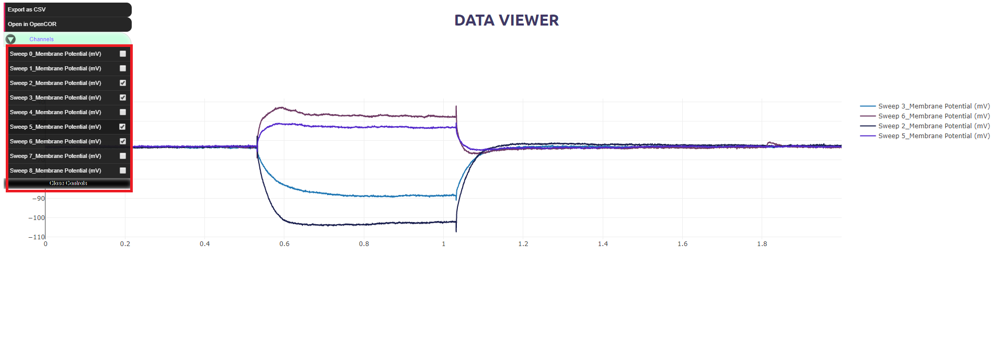
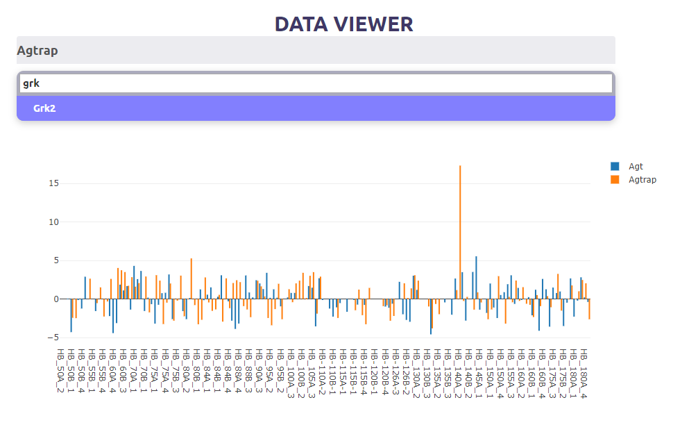
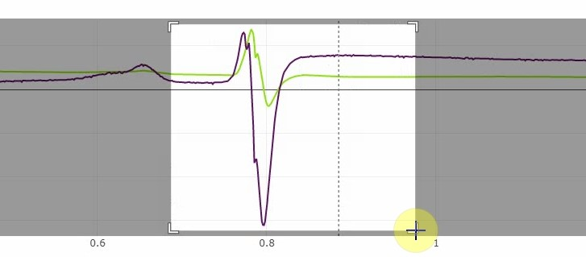
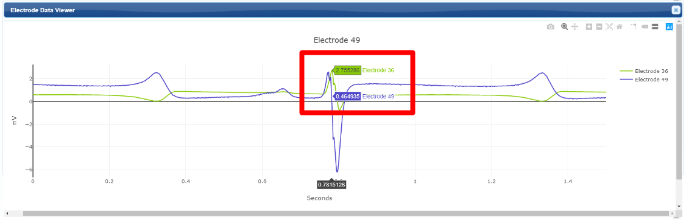
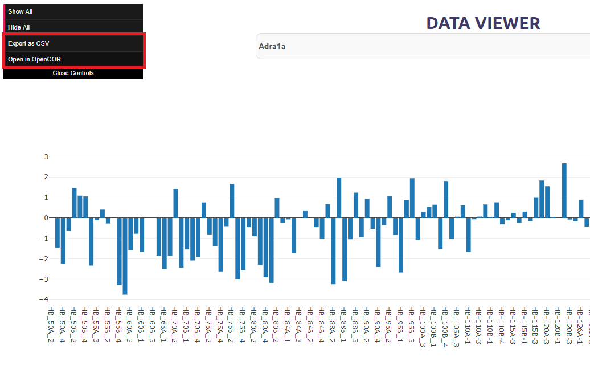
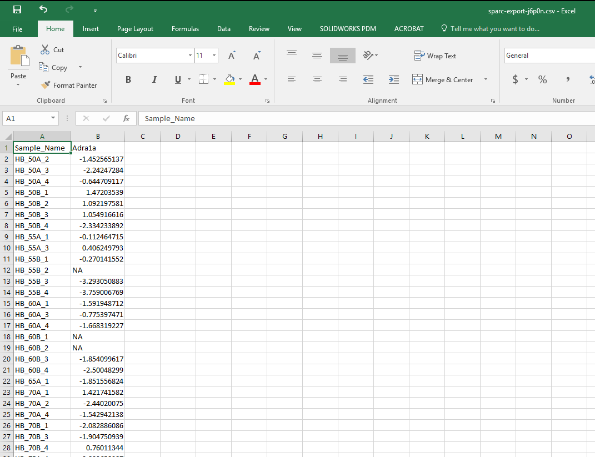

.. |data-icon| image:: /_images/data_icon.png
					:width: 10 %

|data-icon| Data Viewer
=======================
A module of the data portal designed for viewing and exporting Ephys and Genome data.

.. contents:: Contents:
   :local:
   :depth: 2
   :backlinks: top

Overview
********

This document describes how to use the data plotting viewer tool available on the SPARC Data Portal. Examples of this tool in action are available at https://data-viewer-demo.netlify.com/.

This module has the ability to:

    - Plot electrophysiological CSV datasets in the knowledgbase or Blackfynn.
    - Plot genome and other static CSV datasests.
    - Navigate large datasets via the user interface.
    - Add and remove channels from a plot and export them.
    - Export selected channels as CSV for use in Excel or `OpenCOR <https://opencor.ws/>`_.

Viewer Configuration
********************

The viewer has two modes, for small and large datasests.

Small Datasets
--------------

This mode is used for smaller datasets and has more control over exports. (All checked channels will be exported.)

Large Datasets
--------------

This mode is used to navigate larger datasets. It has search capability to plot the desired channels.

Interactive Graphics Controls
*****************************

You can refine the view by dragging over a region of interest.

.. ..

You can also add or remove data by clicking on its label.

.. figure:: _images/select_channel.jpg
   :figwidth: 45%
   :width: 80%
   :align: center

The table below describes the effect of different user actions in the flatmap being displayed.

======================= ==============
Mouse action            Result
======================= ==============
``left-click``          Zoom in via box selection
----------------------- --------------
``middle-click``        Zoom in via box selection
----------------------- --------------
``double-click``        Reset the view
======================= ==============

CSV (Comma-Separated Values) Exports
************************************

The selected data traces plotted are exported to a CSV file for use in Excel, OpenCOR or any CSV-capable software.

Export as CSV
-------------

Data in Excel
-------------

