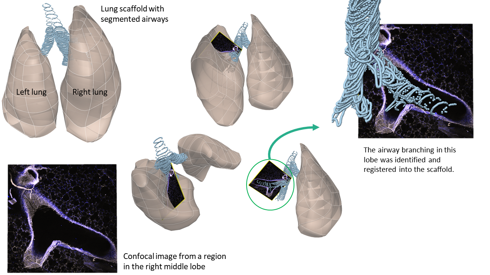
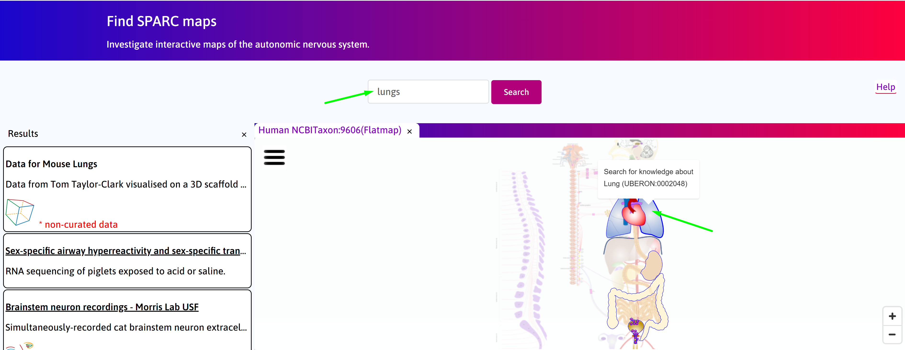
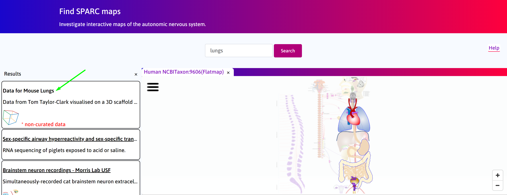
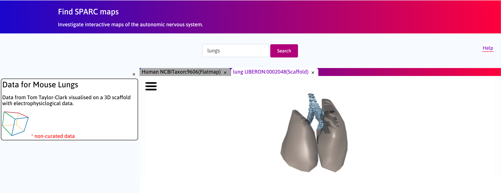
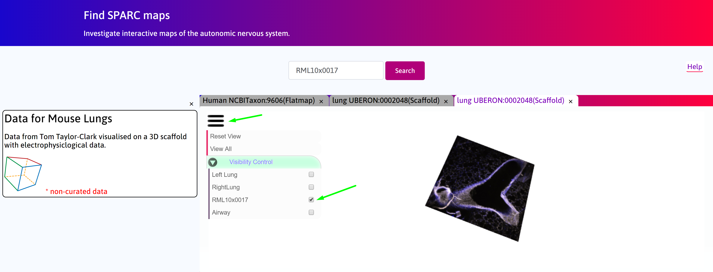

Mapping Gene Expression in the Mouse Lungs from Images to Scaffold
===================================================================		
.. |open-control| image:: /_images/open_control.png
                      :width: 2 em	

.. |scaffold-map-icon| image:: /_images/scaffold_map_icon.png					  
						:width: 2 em				  
.. contents:: Contents: 
   :local:
   :depth: 2
   :backlinks: top
   
Overview
********

A 3D scaffold of the mouse thoracic cavity created using segmentation of longitudinal microCT scans from the SIMBA VIA (Vision and Image Analysis) public database is visualized in the webGL window. The trachea and main bronchi are also shown as rings of segmented points. Confocal stained images from Taylor-Clark group for mouse lungs are embedded into the scaffold. The confocal images were obtained from the right middle lobe (RML). The scaffold was registered to ensure alignment with the airway branch visible on the confocal. This use-case will be the first of many that link the organ systems with the brain stem.

   
Below is an **introductory video** which explains how an anatomically based 3D thoracic shape of the lungs are generated. 

.. raw:: html

	<iframe width="560" height="315" src="https://www.youtube.com/embed/8FDcPuwWAQo" frameborder="0" allow="accelerometer; autoplay; encrypted-media; gyroscope; picture-in-picture" allowfullscreen></iframe>   

Step-by-step instructions 
*************************
Follow these step-by-step instructions to familiarise yourself with the flow of the web interface.

**Step 1.** Search for keyword **Lungs**.

   
**Step 2.** Select **Data for Mouse Lungs** from the search results. Click on |scaffold-map-icon| icon. 

   
**Step 3.**  Allow model to load.

**Step 4.** To view only the confocal image in the right middle lobe (RML), select only RML10x007 checkbox after clicking on |open-control| icon for drop-down menu.

