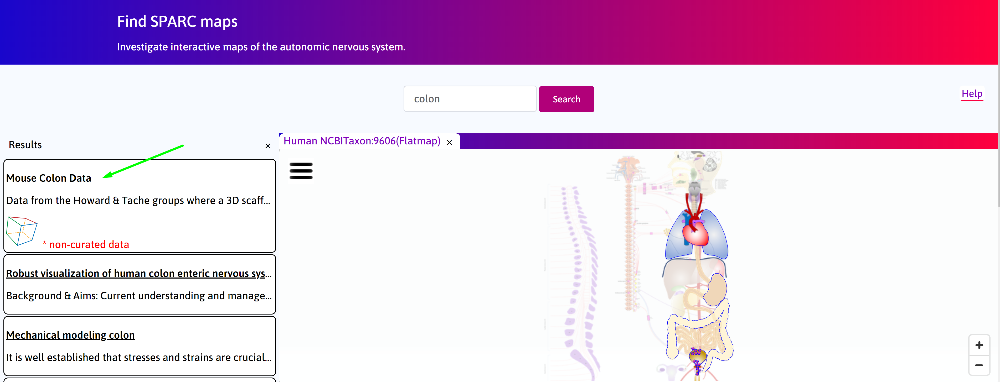
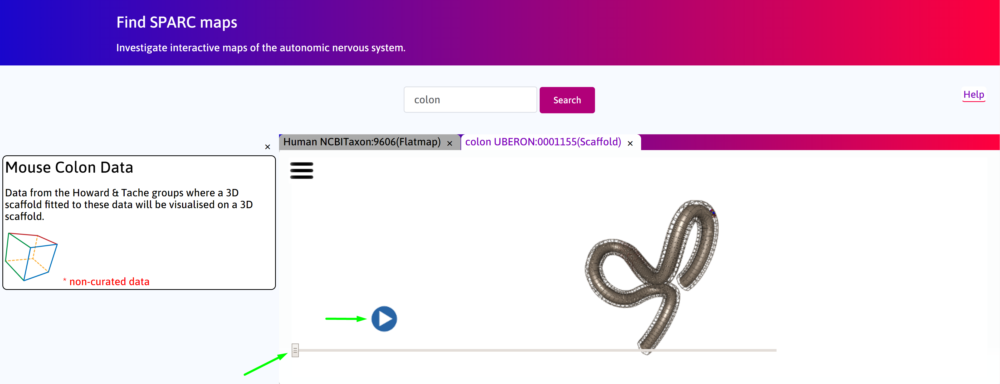
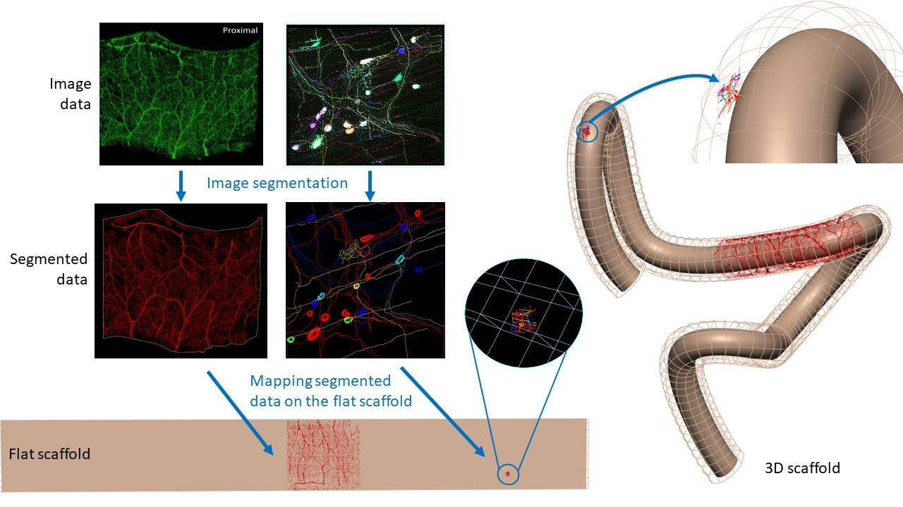

Mapping Image Data in Mouse Colon
=================================
.. |scaffold-map-icon| image:: /_images/scaffold_map_icon.png					  
						:width: 2 em
.. contents:: Contents: 
   :local:
   :depth: 2
   :backlinks: top
   
Overview
********

A 3D scaffold fitted to the structural data of mouse colon is visualized. Apart from its 3D configuration, the scaffold is displayed as a flat preparation which represents the state where a colon is stretched out, cut open and laid flat on a surface for imaging purposes.  Segmented image data of enteric neurons and nerve fibers (Tache group) and vasculature (Howard group) of mouse tissue samples are mapped onto the flat scaffold based on the locations where the tissue samples were obtained from.  This allows image and experimental data to be embedded and displayed at labelled material points on the scaffold in both its 3D and flat configuration. 

Step-by-step instructions 
*************************

Follow these step-by-step instructions to familiarise yourself with the flow of the web interface.

**Step 1**. The default **Result** column displays the use cases available on the portal. Click on the
*Mapping Image Data in Mouse Colon* box. Click on the scaffold icon (|scaffold-icon|). Click on the scaffold icon (|scaffold-map-icon|).

	
**Step 2**. Allow a few seconds for the scaffold to load. Navigate between the 3D and flat scaffold using the slider. Click on the **play** button to automate toggle between the two configurations. 

      

Scaffold Generation
*************************
      
The Figure below illustrates an overview of the workflow.

Below is an **introductory video** which explains how the structural data of mouse colon are mapped onto a 3D scaffold.

.. raw:: html
			
     <iframe width="560" height="315" src="https://www.youtube.com/embed/gX2Njaqbk7U" frameborder="0" allow="accelerometer; autoplay; encrypted-media; gyroscope; picture-in-picture" allowfullscreen></iframe>      