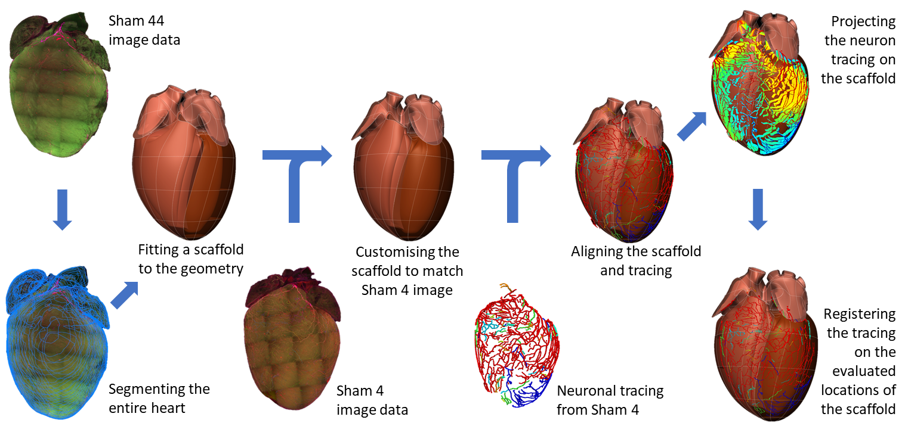
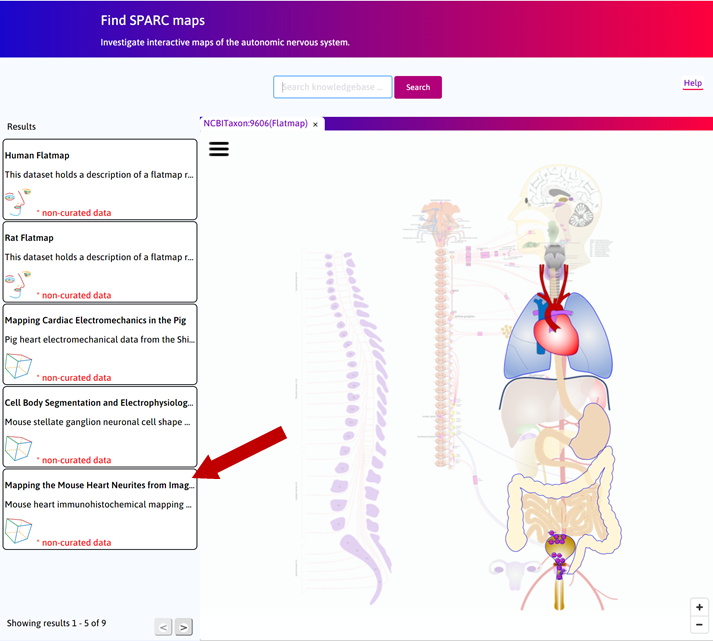
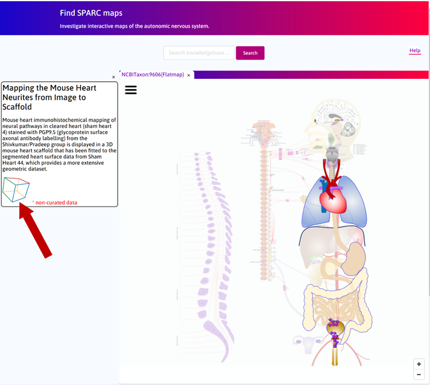
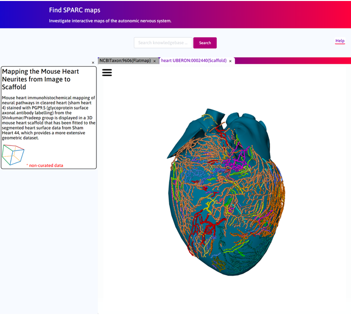
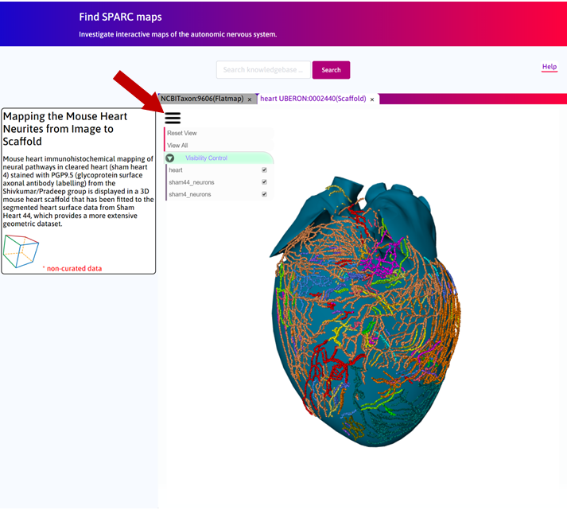
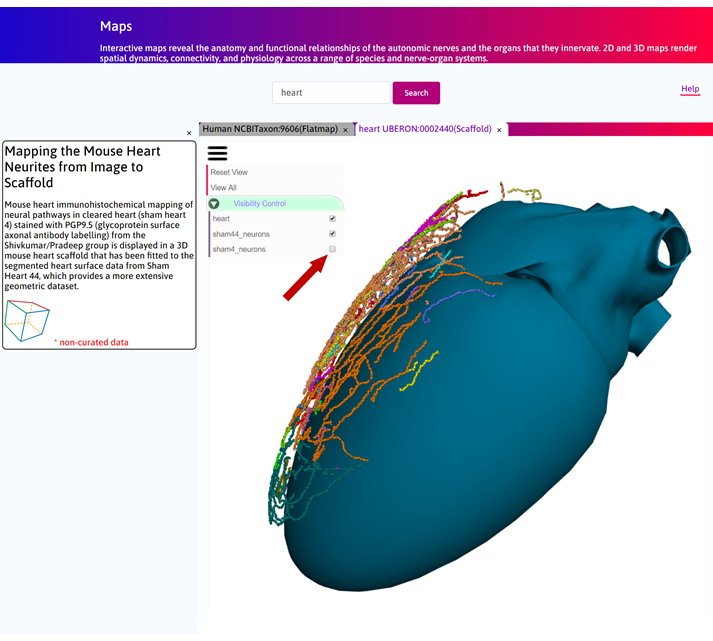
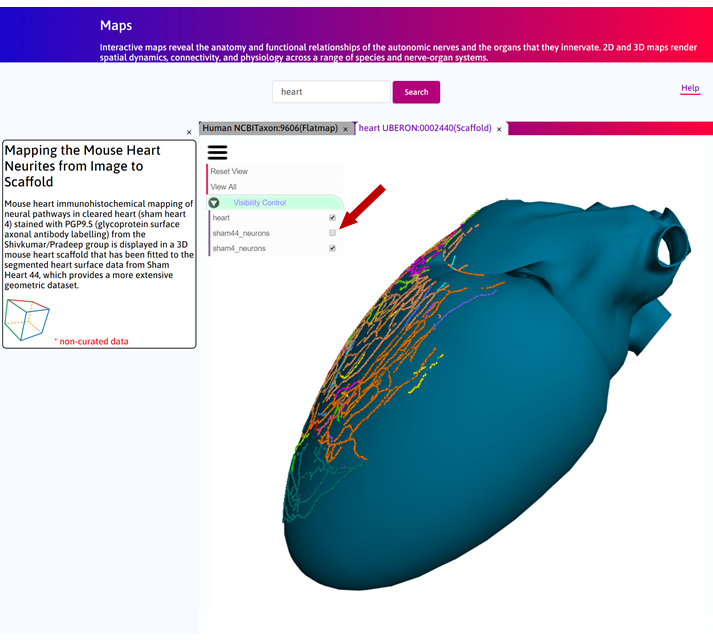
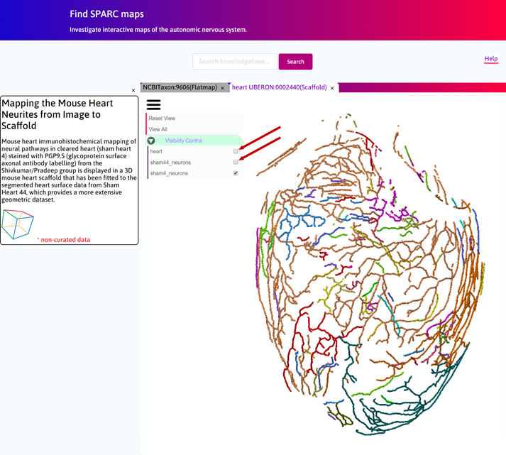

Mapping the Mouse Heart Neurites from Image to Scaffold
========================================================

.. |scaffold-icon| image:: /_images/scaffold_icon.png
                      :width: 2 em

.. |open-control| image:: /_images/open_control.png
                      :width: 2 em

.. contents:: Contents: 
   :local:
   :depth: 2
   :backlinks: top
   
Overview
********
   
Mouse heart immunohistochemical mapping of neural pathways in cleared heart (sham heart 4) stained with PGP9.5
(glycoprotein surface axonal antibody labelling) from the Shivkumar/Pradeep group is displayed in a 3D mouse heart
scaffold that has been fitted to the segmented heart surface data from Sham Heart 44, which provides a more extensive
geometric dataset. Future experiments are likely to provide much better quality mouse data for both the heart's anatomy
and its embedded neurons. Figure 1 illustrates an overview of the workflow.

Below is an **introductory video** which explains the mapping of the mouse heart neurites from image to scaffold.

.. raw:: html

    <iframe width="560" height="315" src="https://www.youtube.com/embed/B0JKztUZFio" frameborder="0" allow="accelerometer; autoplay; encrypted-media; gyroscope; picture-in-picture" allowfullscreen></iframe>

Step-by-step instructions 
*************************

Follow these step-by-step instructions to familiarise yourself with the flow of the web interface.

**Step 1**. The default **Result** column displays some of the use cases available on the portal. Click on
*Mapping the Mouse Heart Neurites from Image to Scaffold* box.

   
**Step 2** Now click on the |scaffold-icon| to open the **Scaffold Viewer** tab to visualise the heart scaffold.

**Step 3**. In the **Scaffold Viewer** tab, there are three objects visible: 1) fitted heart scaffold, 2) sham heart 44
neurite tracing, 3) sham heart 4 neurite tracing.

**Step 4**. Click on |open-control| to open the control panel.

**Step 5**. Turn off Sham 4 neurons to only visualise the scaffold and Sham 44 neurons.

**Step 6**. Turn Sham 4 neurons back on and now turn off Sham 44 neurons to visualise the registered neurons on the scaffold
surface.

**Step 7**. To visualise only the neurons, turn off the scaffold.

