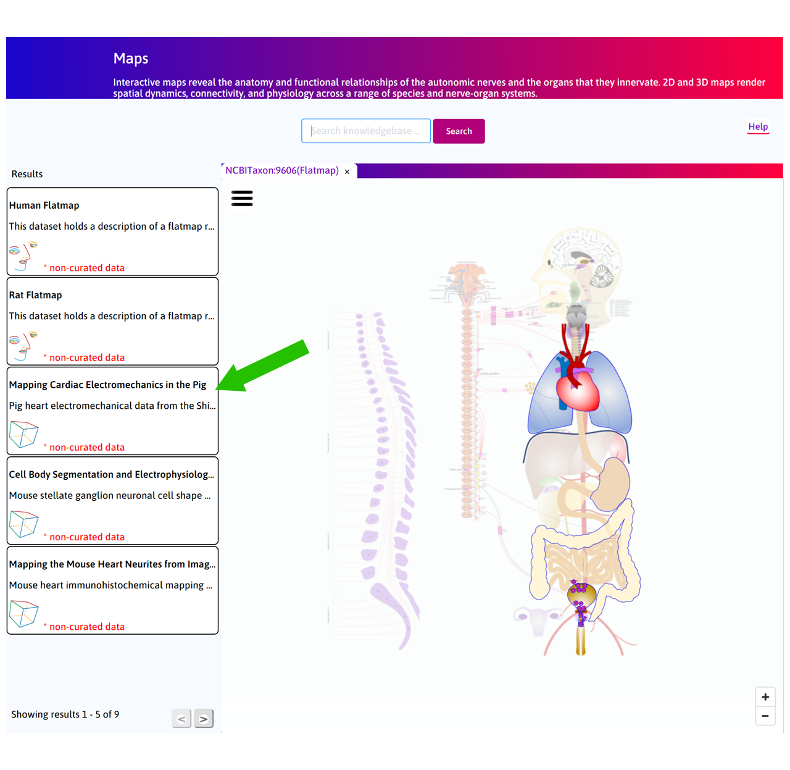
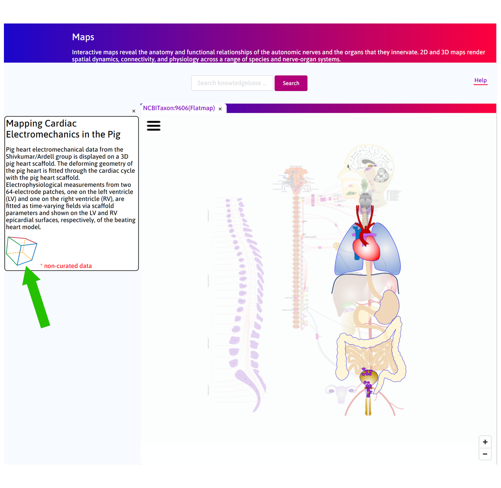
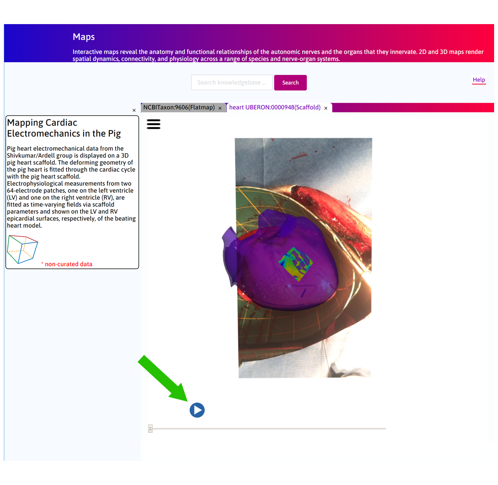
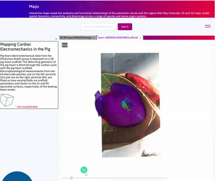
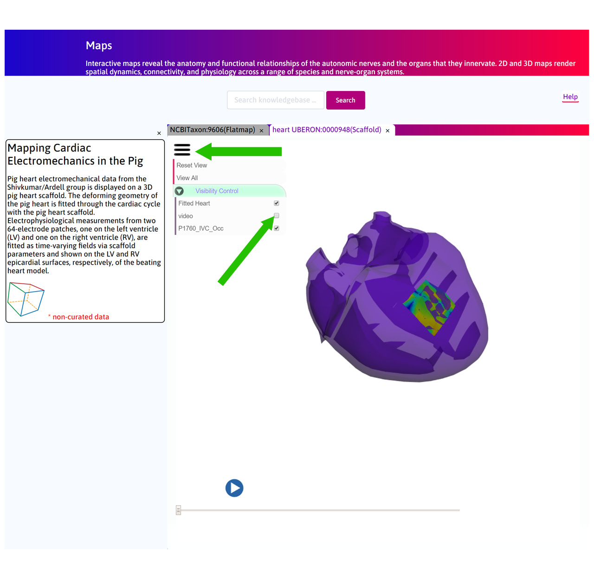

Mapping Cardiac Electromechanics in the Pig
===========================================
.. |open-control| image:: /_images/open_control.png
                      :width: 2 em

.. |scaffold-map-icon| image:: /_images/scaffold_map_icon.png
						:width: 2 em

.. contents:: Contents: 
   :local:
   :depth: 2
   :backlinks: top
   
Overview
********
	
Pig heart electromechanical data from the Shivkumar/Ardell group is displayed on a 3D pig heart scaffold.
The deforming geometry of the pig heart is fitted through the cardiac cycle with the pig heart scaffold.
Electrophysiological measurements from two 64-electrode patches, one on the left ventricle (LV) and one on the right
ventricle (RV), are fitted as time-varying fields via scaffold parameters and shown on the LV and RV epicardial surfaces,
respectively, of the beating heart model. *Note* that these electromechanical data, fitted to the 3D scaffold, are from
the same pig heart and include both physiological normal contracting heart beats and the whole heart response to stellate
stimulation. This use-case demonstrates the use of the scaffold to merge two types of data set (one mechanical and one
electrophysiological) and begins to illustrate the connection between stimulation of the peripheral nervous system and
the response at the whole heart level.

This document guides a user of the SPARC Data Portal through the steps required to discover some data looking at
autonomic control of the heart.

Step-by-step instructions 
*************************

Follow these step-by-step instructions to familiarise yourself with the flow of the web interface.

**Step 1:** The default **Result** column displays some of the use cases available on the portal. Click on the
*Mapping Cardiac Electromechanics in the Pig* box.

   
**Step 2:** Click on the |scaffold-map-icon| to open the **Scaffold Viewer** tab to visualise the heart scaffold.

**Step 3:** In the **Scaffold Viewer** tab, a 3D pig heart scaffold has been fitted to the 2D video data.
In addition a 64-electrode patch mesh has been constructed from the original electrode patch on the surface of the left
ventricular epicardium. Electro-physiological data recorded from this patch has been registered on the mesh and a field
is displayed on the surface of this mesh. This mesh is then *embedded* on the corresponding surface of the scaffold.

Press **play** to see the video.

**Step 4:** By clicking on |open-control| you can control visibility of each of the graphical objects in the scene.

Future Steps
*************************
In the current version, the scaffold has only been fitted to the video data through anisotropic scaling and
some shear. This was a limitation as only one view angle was available. In future, a stereo camera system will be installed
to reconstruct a 3D view of the beating heart in order to accurately fit the scaffold and capture the deformation of cardiac
tissue.