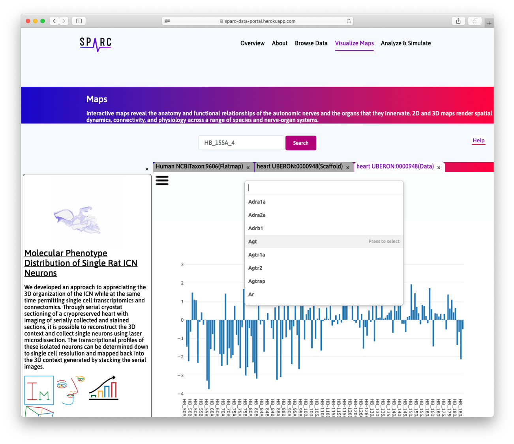

Mapping Cellular Gene Expression in the Rat Heart from Image to Scaffold
=========================================================================
.. |open-control| image:: /_images/open_control.png
                      :width: 2 em

.. contents:: Contents:
   :local:
   :depth: 2
   :backlinks: top

Overview
********

Rat heart geometric `3Scan <www.3scan.com>`_ data for both ventricles and both atria from the Schwaber/Vadigepalli/Cheng group has been fitted with a 3D rat heart scaffold.
The location of a cluster of 151 ICN cell samples, which have been lifted for RNA-Seq analysis (molecular cell body transcript data) from a region of the left atrium (from a different animal), are indicated on the 3D scaffold.
To click on one of these tissue locations displays the RNA message level for the 154 genes examined.
To visualize the spatial distribution of the RNA message, the 151 samples have been fitted with a continuous field description using scaffold nodal parameters.
Any one of the 154 genes can be selected to show the spatial variation of that transcript as a heat map.
Rat heart neural pathway data showing the efferent connectome linking ICN cells in the left atrium and the SA node cells on the right atrium are visualized in the next iteration of this use case.

**Note:** the treatment process needed to extract the cells for RNA-Seq analysis left that rat heart in a very distorted state and was therefore not fitted with a scaffold.
Instead, corresponding locations of the ICN cells in the much less distorted 3Scan-processed heart were identified by eye and the cell information was transferred to that heart.

.. figure:: _images/use_case4_workflow_white.png
   :figwidth: 95%
   :width: 90%
   :align: center

Step-by-step instructions
*************************

Follow these step-by-step instructions to familiarize yourself with the flow of the Web interface.

**Step 1**. Click on the Heart on the flatmap to generate search results for heart, i.e. `UBERON:948 <http://purl.obolibrary.org/obo/UBERON_0000948>`_.

**Step 2**. Click on the cube icon.

**Step 3**. The Scaffold Viewer tab opens and the fitted heart scaffold can be visualized.
A number of lifted neuronal cells have been mapped and registered on the scaffold (purple spheres).

**Step 4**. Click on the |open-control| icon to pop up the drop-down menu.
Visibility can be turned *on* or *off* for each item.

**Step 5**. Hover on the different regions to highlight the chambers separately.

**Step 6**. Each cell has been lifted and assayed for the expression of 154 genes selected as associated with neuromodulation and cardiac function using qPCR or RNASeq.
These have been mapped on the registered cells on the scaffold.
Each cell has a unique ID.

**Step 7**. Now, click on the bar chart icon.

**Step 8**. The Data Viewer tab opens to view the gene expression data.
At this point, the data can only viewed using a bar chart.
However, additional visualization capabilities, such as heatmap and clustering, will be available in the future.

**Step 9**. From the drop-down menu, more genes can be added to the bar chart.

**Step 10**. The bar chart will show the expression of each gene using a unique color for all the registered cells on the scaffold.

