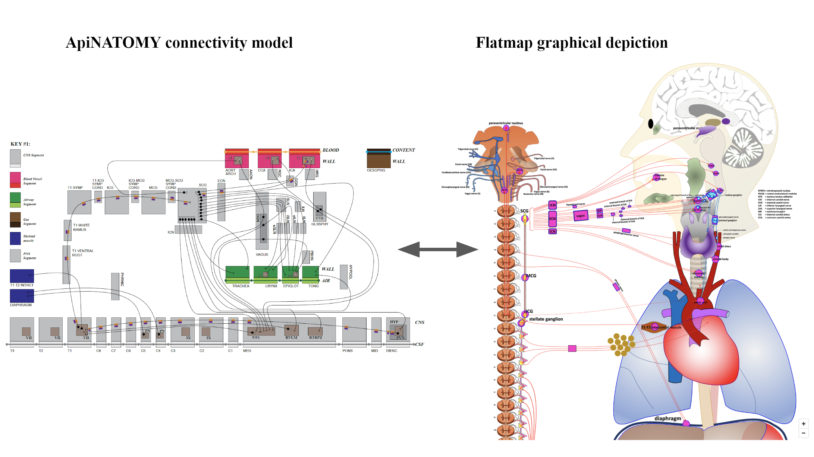
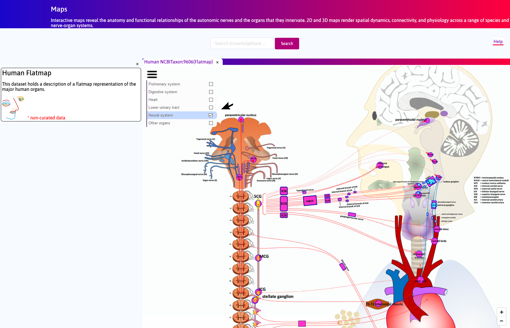
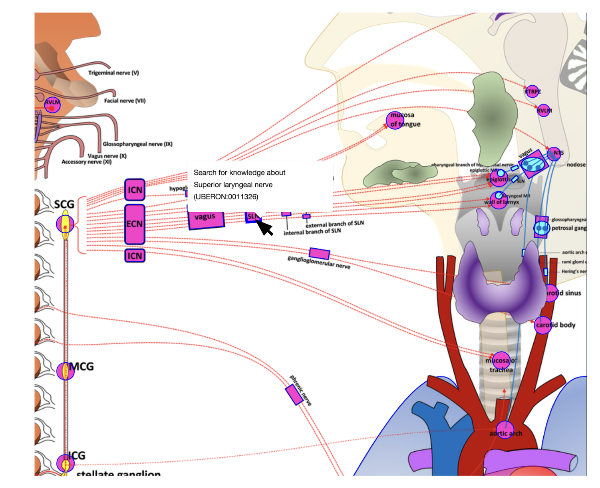
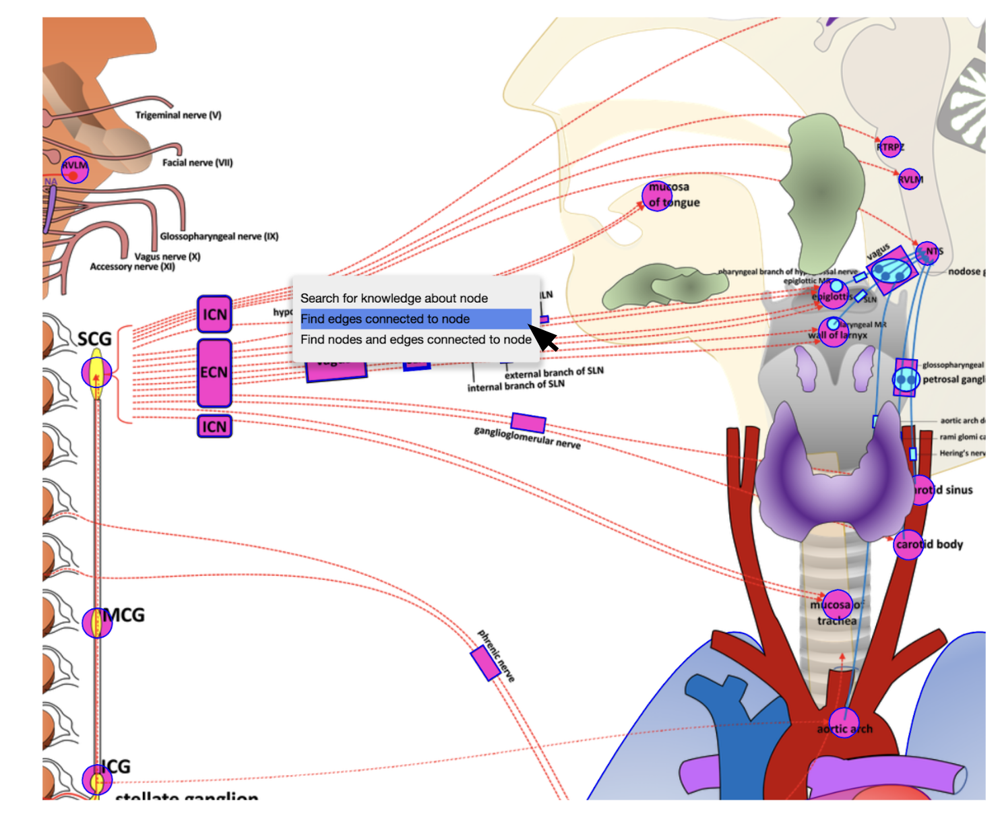
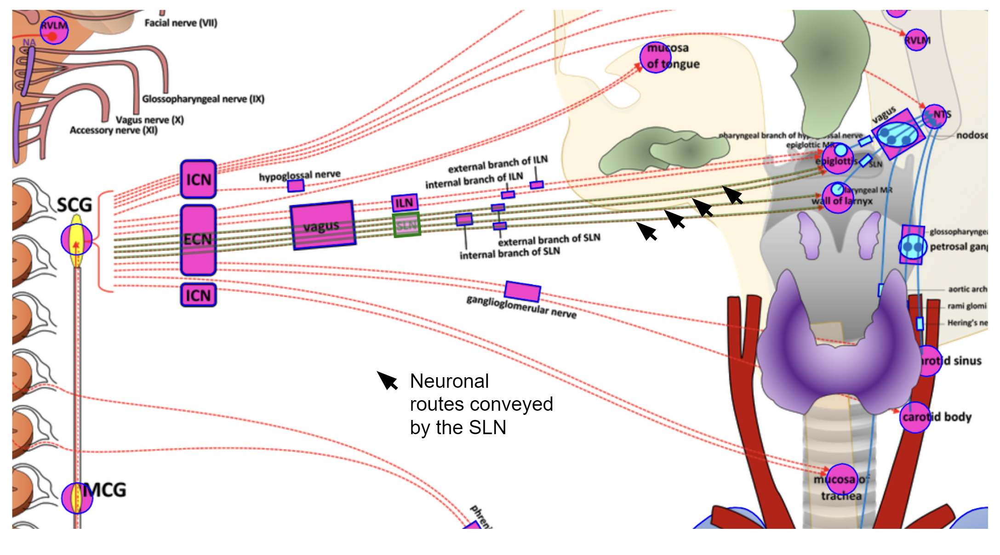
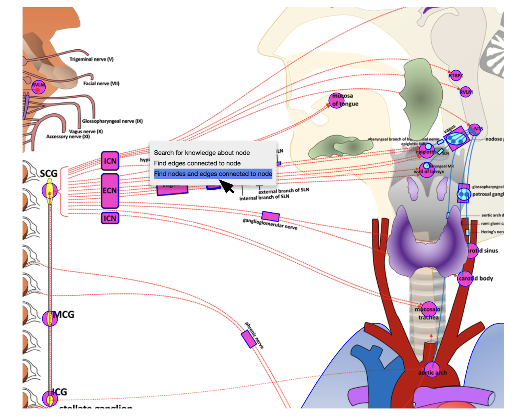
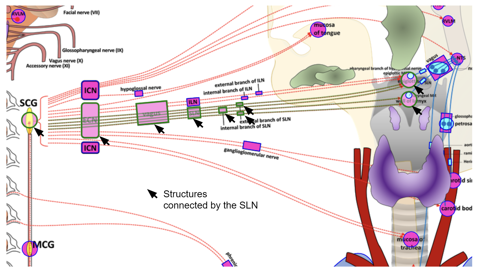

Rat Superior Cervical Ganglion
==============================
.. contents:: Contents: 
   :local:
   :depth: 2
   :backlinks: top
   
Overview
********

Mapping of neuroanatomical connectivity is illustrated using rat superior cervical ganglion (SCG) data from Steve Lewis’ group at CWRU and rat brainstem data from Don Bolser’s group at UFL. This knowledge is assimilated into the SPARC SciGraph, to demonstrate cross-domain data linkage. The Bolser and Lewis work has three major areas of physiological complementarity:

**Larynx/Trachea**: The sensory (Bolser) and motor (Lewis) limbs of protective mechanisms for the upper respiratory tract are captured in the connectivity model. 

**Carotid Body**: Chemosensing for oxygen partial pressure by the Carotid Body is key to respiratory control (Bolser). The SCG (Lewis) sends effector projections to the Carotid Body that modulate its chemosensing.

**Carotid Sinus**: Non-intuitively, blood pressure sensing by the carotid sinus is also key to respiratory control (Bolser). The SCG (Lewis) sends effector projections to the Carotid Sinus that modulate its barosensing.

Knowledge that links the above pathways provides a key means to discover multiple datasets (usually siloed behind institutional and collaborative divides) in these diverse physiology domains.

Step-by-step instructions 
*************************

Follow these step-by-step instructions to familiarise yourself with the flow of the web interface.

**Step 1**. Select **Neural system** from the drop-down menu |open-control| on the human flatmap.

   
**Step 2**. *Right-click* on **pink rectangles** that symbolizes portion of nerve.

**Step 3**. *Left-click* on ‘Find edges connected to node’ to find neuronal routes conveyed by the selected nerve.

   
Neuronal routes conveyed by the SLN as shown below.

**Step 4**. *Left-click* on ‘Find nodes and edges connected to node’ to find data relevant to structures connected by the selected nerve.

   
Structures connected by the SLN as shown below.

