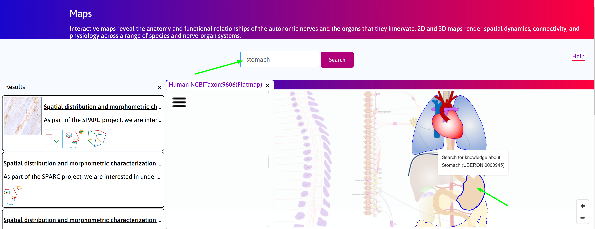
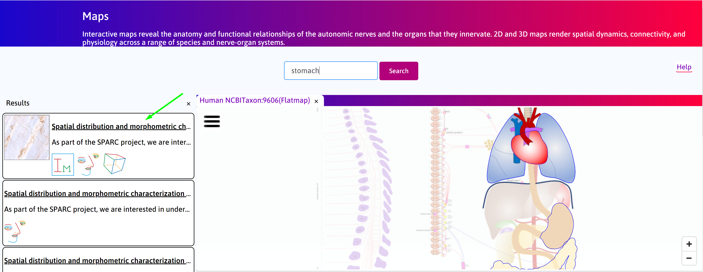
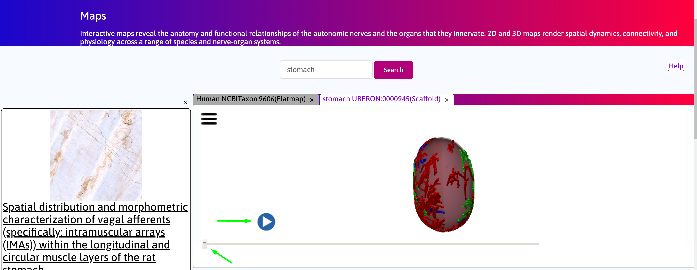
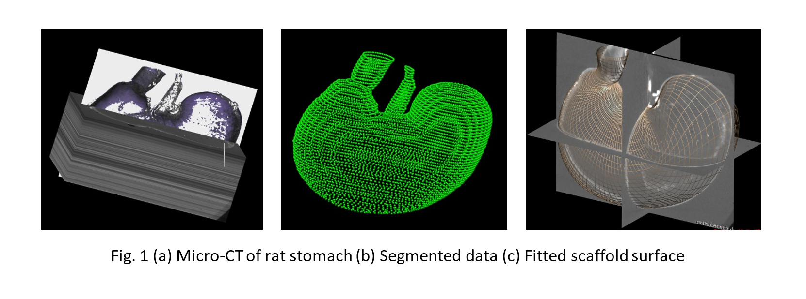
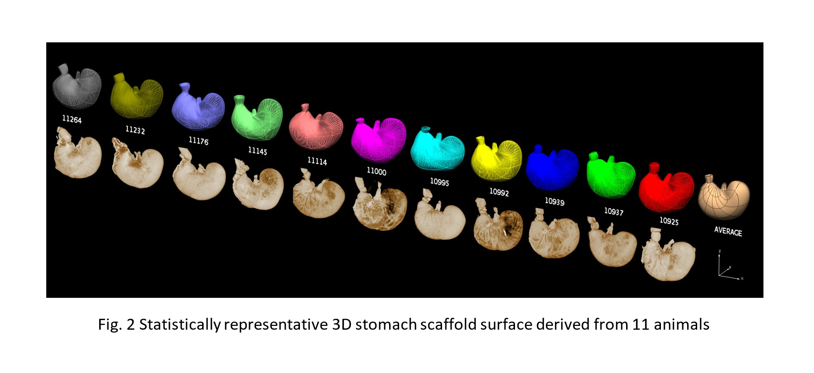
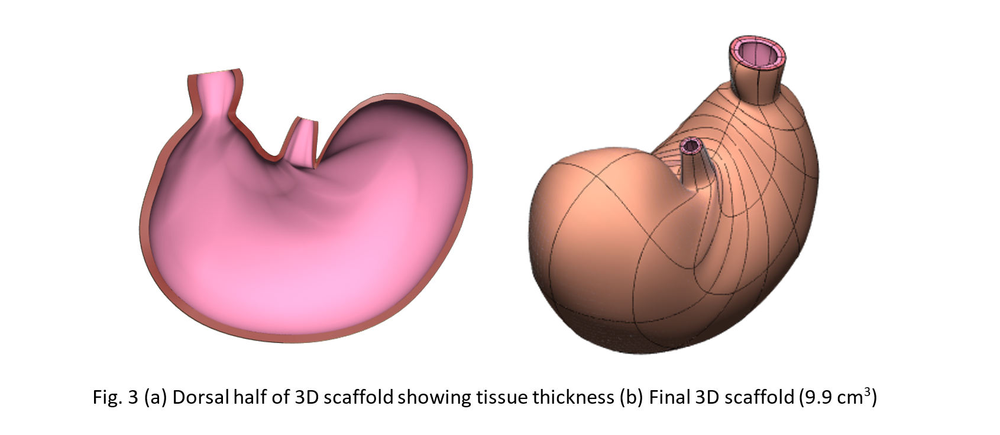
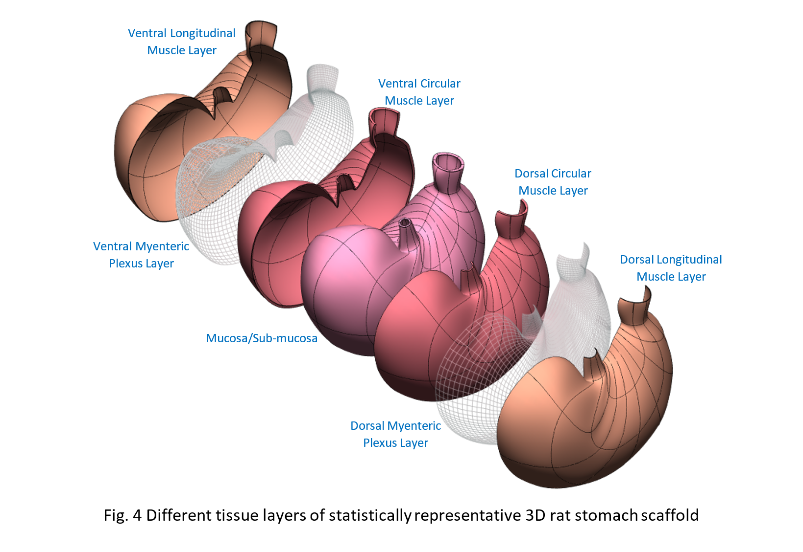
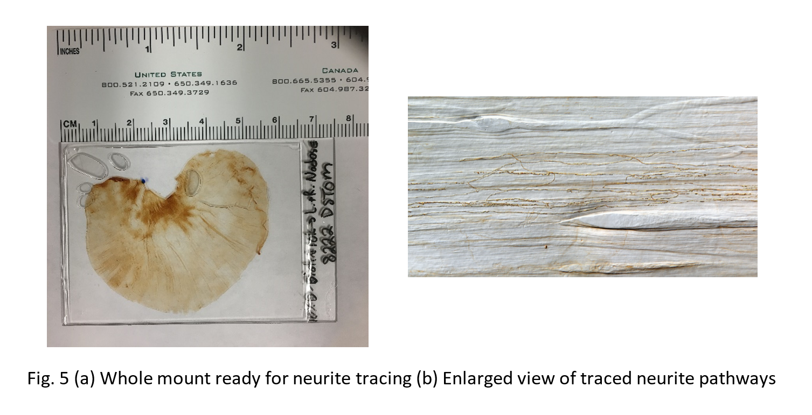
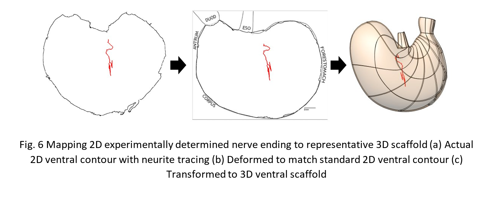
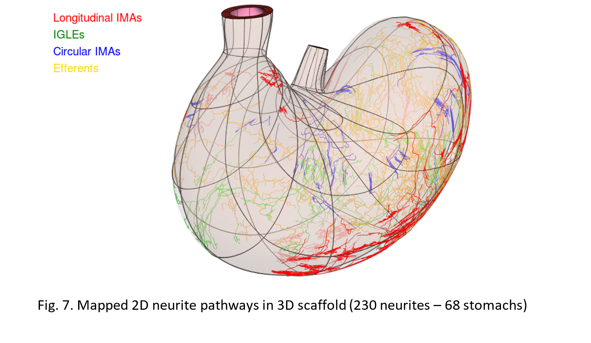

3D Mapping and Visualization of 2D Experimental Data Stomach Afferents and Efferents
====================================================================================
			   
.. |scaffold-icon| image:: /_images/scaffold_map_icon.png
                      :width: 2 em

.. contents:: Contents: 
   :local:
   :depth: 2
   :backlinks: top
   
Overview
********

A 3D scaffold of the rat stomach created using segmented microCT data from the Powley group is shown in a 3D window. The neurites including nerve endings (both IGLEs and IMAs) are displayed on the 3D scaffold. The scaffold can be cut and opened out flat to match the experimental whole-mount preparation, and to then display the experimental data. Note that 152 neurite maps (from 152 different rats) were each registered to a fitted scaffold for each rat and then morphed into the average flat mount scaffold. The data and models can also be seen at varying levels of stomach fills. This use-case demonstrates both the application of neural pathway data to the stomach, the use of a transformation between the normal 3D stomach anatomy and the 2D whole-mount preparation, and the ability to visualize data at varying levels of organ state (empty to full).  

Step-by-step instructions 
*************************

Follow these step-by-step instructions to familiarise yourself with the flow of the web interface.

**Step 1**. Click on the Stomach on the flatmap to generate search results. Alternatively, perform a search using keyword *stomach*, or UBERON:0000945.

**Step 2**. Select **Spatial distribution and morphometric characterization of vagal afferents (specifically: intramuscular arrays (IMAs)) within the longitudinal and circular muscle layers of the rat stomach** from the search results. Click on the scaffold icon (|scaffold-icon|).

**Step 3**. Allow a few seconds for the scaffold to load. Navigate between the 3D scaffold and layers view using the slider. Click on the play button to automate toggle between the configurations.

How it is achieved?
*******************

A statistically representative and anatomically-based 3D scaffold of the rat stomach was created to map 230 nerve ending pathways traced from 68 2D rat stomach whole mounts. Micro-CT image data of 11 animals with an average volume of 9.9cm3 were used to construct this 3D scaffold. Imaging and subsequent data segmentation was performed at the Powley laboratory in Purdue University using MBF bioscience software Neurolucida. 
Initially, an approximate surface was generated for each case using gross morphometric measurements of the organ. These surfaces were then fitted to the segmented data using University of Auckland Bioengineering software (fig. 1). The fitted scaffolds surfaces (11) were combined to form an average stomach surface (fig 2). A representative tissue thickness throughout the organ inferred by careful examination of all segmented data sets was included to generate the final 3D scaffold (fig 3).

   

   
The tissue wall of this 3D scaffold was then split in to three different layers, namely, the outermost longitudinal smooth muscle layer, a layer beneath that to represent the circular smooth muscle layer followed by the mucosal/submucosal layer. A very thin membrane was also introduced to mimic the layer containing myenteric plexus between the smooth muscle layers (fig. 4). The thickness of different tissue layers in the current 3D scaffold is an approximate based on experimental observations. Plans are under way to acquire more detailed high resolution images to better understand the tissue structural composition. Once that information is available, the 3D scaffold’s tissue layers will be updated accordingly. 

A total of 230 neurite pathways imaged and segmented from whole mounts of 68 different rats were then mapped in to the multi-layered 3D scaffold. Specimen preparation, imaging and tracing of nerve endings were conducted at the Powley laboratory and Neurolucida has been used for image processing (fig. 5). Each neurite, either from dorsal or ventral half, with its whole mount contour was first deformed in the X-Y plane to match its respective standard contour using a free-form deformation technique (fig 6). The standard contour (dorsal or ventral) was then transformed with its contents to its 3D counterpart (fig 6). The latter is either the dorsal or ventral half of the statistically representative 3D scaffold described earlier. Free-form deformation and subsequent 2D to 3D transformation was carried out using University of Auckland Bioengineering software.

   
The neurites consisted of three types of afferents- longitudinal intramuscular arrays (IMAs), intraganglionic laminar endings (IGLEs) and circular IMAs and efferents were mapped from their original 2D contours through the standard 2D contour and then finally to the 3D scaffold. The IGLEs (afferents) and efferents were placed between smooth muscle layers (myenteric plexus layer) while IMAs were included in the middle of respective smooth muscle layers (fig. 7). 

