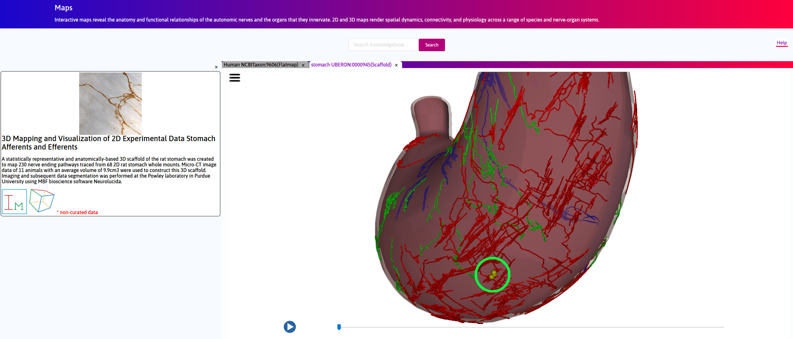

3D Mapping and Visualization of 2D Experimental Data Stomach Afferents and Efferents
====================================================================================
			   
.. |scaffold-icon| image:: /_images/scaffold_map_icon.png
                      :width: 2 em

.. contents:: Contents: 
   :local:
   :depth: 2
   :backlinks: top
   
Overview
********

A 3D scaffold of the rat stomach created using segmented microCT data from the Powley group is shown. The neurites including nerve endings (both intraganglionic laminar endings (IGLEs) and longitudinal intramuscular arrays (IMAs) are displayed on the 3D scaffold. The scaffold can be cut and opened out flat to match the experimental whole-mount preparation, and to then display the experimental data. Note that 152 neurite maps (from 152 different rats) were each registered to a fitted scaffold for each rat and then morphed into the average flat mount scaffold. 
At specific locations on the scaffold, the corresponding microscopy image of the neurite can be seen via Biolucida.
This use-case demonstrates both the application of neural pathway data to the stomach and the use of a transformation between the normal 3D stomach anatomy and the 2D whole-mount preparation.

Step-by-step instructions 
*************************

Follow these step-by-step instructions to familiarise yourself with the flow of the web interface.

**Step 1**. The default **Result** column displays the use cases available on the portal. Click on the
*3D Mapping and Visualization of 2D Experimental Data Stomach Afferents and Efferents* box. Click on the scaffold icon (|scaffold-icon|).

.. figure:: _images/stomach_2.png
   :figwidth: 95%
   :width: 95%
   :align: center

**Step 2**. Allow a few seconds for the scaffold to load. Navigate between the 3D scaffold and layers view using the slider. Click on the play button to automate toggle between the configurations.

.. figure:: _images/stomach_3.png
   :figwidth: 95%
   :width: 95%
   :align: center
   
**Step 3**. Under unexpanded view, right-click and drag to rotate the scaffold. On the longitudinal ventral surface, locate 3 yellow spheres, which represent distinct neurites. 

   
**Step 4**. Click on a yellow sphere. In the left panel inset, a link to a light microscopy image of the neurites in the corresponding location on the fitted scaffold is visible.
   
.. figure:: _images/stomach_5_1.png
   :figwidth: 95%
   :width: 95%
   :align: center
   
Scaffold Generation
*******************

A statistically representative and anatomically-based 3D scaffold of the rat stomach was created to map nerve ending pathways. Micro-CT image data of 11 animals were used to construct this 3D scaffold. Imaging and  data segmentation was performed at the Powley laboratory using Neurolucida (MBF Bioscience). 
An approximate surface was generated for each case using gross morphometric measurements of the organ. These surfaces were then fitted to the segmented data (Fig. 1). The fitted scaffolds surfaces were combined to form an average stomach surface of representative thickness to generate the 3D scaffold, which was subsequently split into three anatomically-distinct tissue layers.

.. figure:: _images/stomach_fig1.png
   :figwidth: 95%
   :width: 95%
   :align: center

230 neurite pathways imaged and segmented from whole mounts of 68 different rats were then mapped into the multi-layered 3D scaffold. Each neurite was first deformed in the X-Y plane to match its standard contour using a free-form deformation technique (Fig 6(a)). The standard contour was then transformed with its contents to its 3D counterpart (b). 

   
The neurites consisted of three types of afferents- IMAs, IGLEs and circular IMAs; efferents were mapped from their standard 2D contour to the 3D scaffold. The afferent IGLEs and efferents were placed between smooth muscle layers (myenteric plexus layer) while IMAs were included between respective smooth muscle layers (Fig. 7). 

.. figure:: _images/stomach_fig7.png
   :figwidth: 95%
   :width: 95%
   :align: center
   
Future Steps
*************************

Plans are under way to acquire more detailed high-resolution images to better understand the tissue structural composition and vasculature. Once  available, the 3D scaffold’s tissue layers will be updated accordingly. 
This includes having the data and models being visualized at varying levels of stomach fills i.e. empty to full states.
