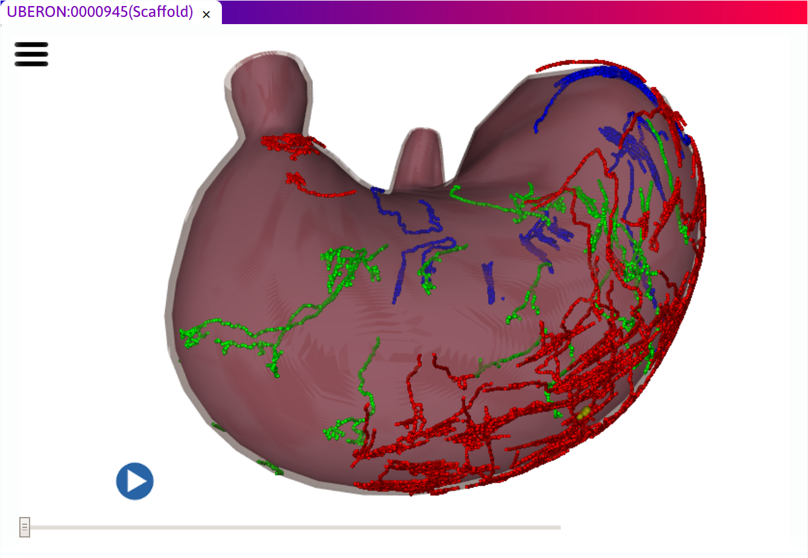

.. _Scaffold-Viewer:

.. |open-control| image:: /_images/open_control.png
                      :width: 2 em
.. |scaffold-icon| image:: /_images/scaffold_map_icon.svg
                      :width: 10 %

|scaffold-icon| Scaffold Viewer
===============================

.. contents:: Contents:
   :local:
   :depth: 2
   :backlinks: top

Overview
********

Some datasets in the SPARC knowledgebase search results are registered to an *anatomical scaffold*: a three dimensional model of the anatomy of interest.
This is indicated by the 3-D box icon shown at the top of this page. Clicking on the icon in search results opens a *Scaffold Viewer* tab in which the scaffold and embedded data can be viewed and interacted with in three dimensions.
The following image of the Scaffold Viewer tab shows a fitted rat stomach scaffold with neurite data from Powley *et al*.

Interaction and viewing
***********************

Moving the mouse pointer over the scaffold or embedded data highlights and overlays a label for what is under it.
With an entity highlighted, clicking with the left button performs a search for the label terms in the SPARC knowledgebase.
The search can bring up related datasets for the study allowing further viewer tabs to be opened.

Interactively rotating, zooming and panning the view gives a greater understanding of the three dimensional structure.
Hold down one of the mouse/controller buttons and drag to change the view. The following table lists the controls.

========================= ==============
Mouse controller action   Result
========================= ==============
Left button click         Search knowledgebase for highlighted entity
------------------------- --------------
Left button drag          Rotate
------------------------- --------------
Middle button drag, wheel Zoom
------------------------- --------------
Right button              Pan
========================= ==============

On some systems, e.g. Mac, modifier keys Ctrl, Alt etc. may be used in place of different buttons.

Some Scaffold Views may contain time-varying or multi-state data.
In these cases a slider control is shown to change the time or state, and a play button enables animation between states.
These controls are shown in the above rat stomach Scaffold Viewer.

Viewer configuration
********************

The |open-control| icon at the top-left corner of the window brings up a menu of additional viewing controls:
	
	* :guilabel:`Reset View` - restore the initial view of the scaffold to the default state.
			
	* :guilabel:`View All` - Zoom in or out to see all of the scaffold in its current orientation.
			
	* :guilabel:`Visibilty Controls` - checkboxes controlling visibility of each entity.
			
Clicking on the |open-control| icon closes this menu.

..
  Examples
  ********

  Selected links to scaffold views from the SPARC data portal:
  .. todo::
  Examples of this tool in action are available (link to specific use case pages here).........

  .. todo::
   write a short paragraph explaining the technology used here.
