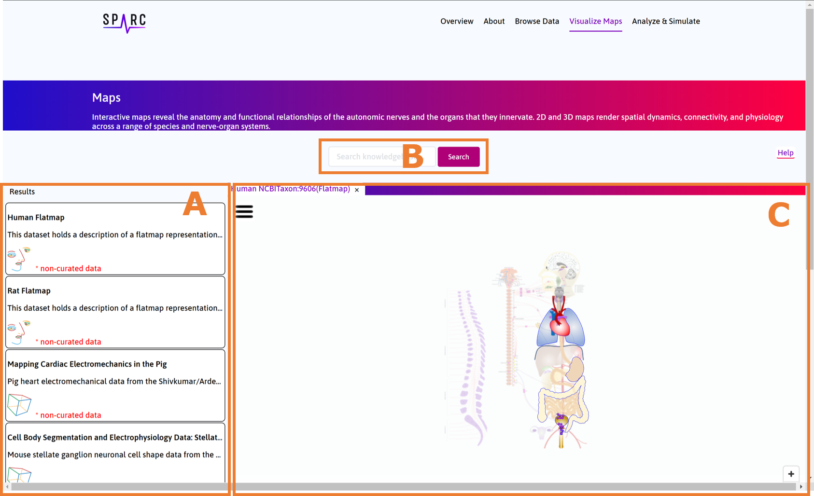

.. _User-Interface:

Map visualization interface
===========================

   The initial user interface for the map visualization interface.
   (A) shows the listing of exemplary use cases, selecting one will display further details and allow access to the appropriate viewers for that use case.
   (B) can be used to directly enter terms to query the knowledgebase for relevant data.
   (C) will, by default, show the human flatmap viewer, but will have tabs added with the appropriate viewers, as requested by the user.

.. toctree::
   :maxdepth: 1
   :caption: Available viewers:

   FlatmapViewer
   DataViewer
   ScaffoldViewer
